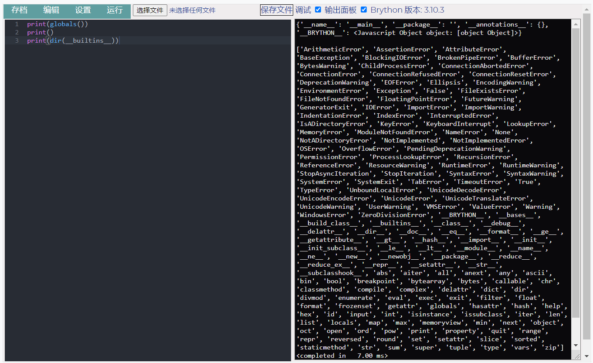

# Brython 编辑器挂件 / widget-brython-editor

一个简单可离线运行的的 Brython 编辑器挂件 
A sample, offline-running widget of Brython Editor.

现已上架[思源笔记社区集市](https://github.com/siyuan-note/bazaar), 如果您需要订阅[思源笔记](https://github.com/siyuan-note/siyuan)增值服务，欢迎使用我的推荐码: **h0sc9rc** 
It is now on the shelves of the [Siyuan Notes Community Bazaar](https://github.com/siyuan-note/bazaar). If you need to subscribe to the value-added services of [siyuan note](https://github.com/siyuan-note/siyuan/blob/master/README_en_US.md), please use my referral code: **h0sc9rc**

# 预览 / PREVIEW

# 功能 / FUNCTION

- 离线使用 Ace 编辑器编辑 Python 脚本 
  Edit Python scripts offline using the Ace editor.
- 离线使用 Brython 库运行 Python 脚本 
  Edit and run Python scripts offline using the Brython library.
  - Brython 库所实现的模块详见 [Brython documentation](https://brython.info/static_doc/en/intro.html) 
    Details of the modules implemented by the library can be found at [Brython documentation](https://brython.info/static_doc/en/intro.html)
- 顶部菜单栏 / Top menu bar
  - 文件菜单 / File menu
    - 加载文档 / Reload
      - 从块属性加载代码与运行结果 
        Load the code with the run results from the block attribute.
    - 保存文档 / Save
      - 保存代码与运行结果至块属性 
        Save the code with the run results to the block attribute.
  - 编辑菜单 / Editor menu
    - 清空编辑器 / Clear editor
      - 将编辑器中的代码全部清空 
        Empty all the code in the editor.
    - 清空输出面板 / Clear output panel
      - 将输出面板中的内容全部清空 
        Empty all the contents of the output panel.
    - 自动换行 / Wrap long code
      - 打开/关闭长代码自动换行 
        Enable/Disable long code wraps.
  - 设置菜单 / Setting menu
    - 语言 / Language
      - 切换界面语言(简体中文/英文) 
        Switch interface languages(Chinese Simplified/English).
    - 主题 / Theme
      - 切换编辑器主题 
        Switch editor themes.
    - 字号 / Font size
      - 切换编辑器与输出面板字号 
        Switch the font sizes of editor and output panel.
  - 运行菜单 / Run menu
    - ▶ 运行代码 / ▶ Run code
      - 运行编辑器中的代码 
        Run the code in the editor.
    - Python
      - 在输出面板中显示 `Python` 运行结果与输出
        Displays the run results and outputs of `Python` in the output panel
    - JavaScript
      - 显示 `Python -> JavaScript` 的翻译结果 
        Displays the translation of `Python -> JavaScript`
    - 分享 / Share code
      - 生成一个用于分享当前编辑器中代码的链接并写入剪贴板 
        Generate a link to share the code in the editor and write the link to the clipboard.
  - 调试 / Debug
    - 在输出面板显示调试信息, 详见 [Testing and debugging](https://brython.info/static_doc/en/test.html) 
      Show debug information in the output panel, details can be found at [Testing and debugging](https://brython.info/static_doc/en/test.html)
  - 输出面板 / Output panel
    - 折叠/展开输出面板 
      Fold/Unfold the output panel.

# 开始 / START

## 自动 / AUTO

该挂件已在[思源笔记社区集市](https://github.com/siyuan-note/bazaar)上架, 可直接在集市中安装 
The widget has been put on the shelves at [SiYuan community bazaar](https://github.com/siyuan-note/bazaar) and can be installed directly in the Bazaar.

## 手动 / MANUAL

1. 在 [./releases](./releases) 中下载发行包, 解压后放到[思源笔记](https://github.com/siyuan-note/siyuan) `<工作空间>/data/widgets/` 目录下 
   Download the release package in [./releases](./releases), unzip it and place it in the `<workspace>/data/widgets/` directory of [SiYuan Note](https://github.com/siyuan-note/siyuan)
2. 在笔记中创建一个 `IFrame` 块, 地址填 `/widgets/widget-brython-editor` 即可 
   Create an `IFrame` block in your notes with the address filled in `/widgets/widget-brython-editor`

# 依赖 / DEPENDENCE

## 源码 / SOURCE

- [GitHub - brython-dev/brython: Brython (Browser Python) is an implementation of Python 3 running in the browser](https://github.com/brython-dev/brython) *[BSD\-3\-Clause License](https://github.com/brython-dev/brython/blob/master/LICENCE.txt)*
- [ajaxorg/ace: Ace (Ajax.org Cloud9 Editor)](https://github.com/ajaxorg/ace) *[View license](https://github.com/ajaxorg/ace/blob/master/LICENSE)*

# 更改日志 / CHANGE LOG

[CHANGE LOG](./CHANGELOG.md)
